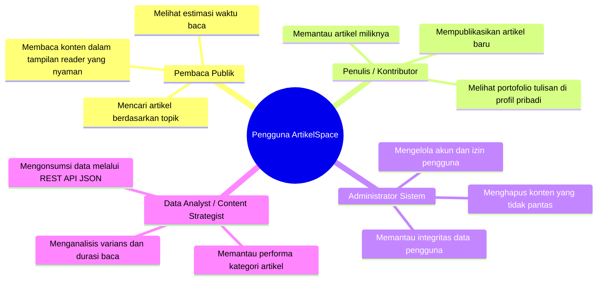
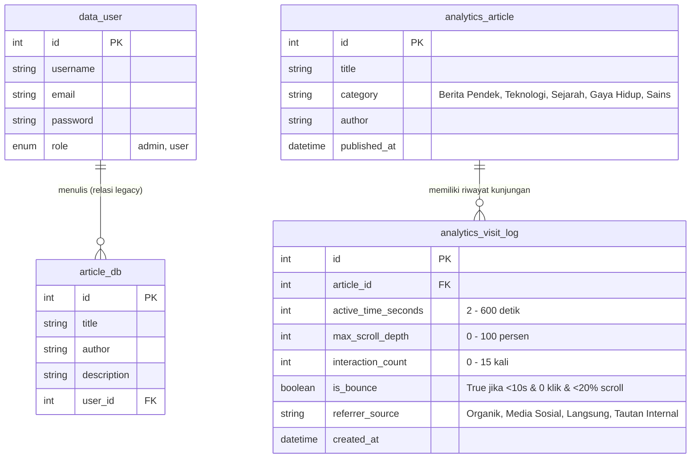
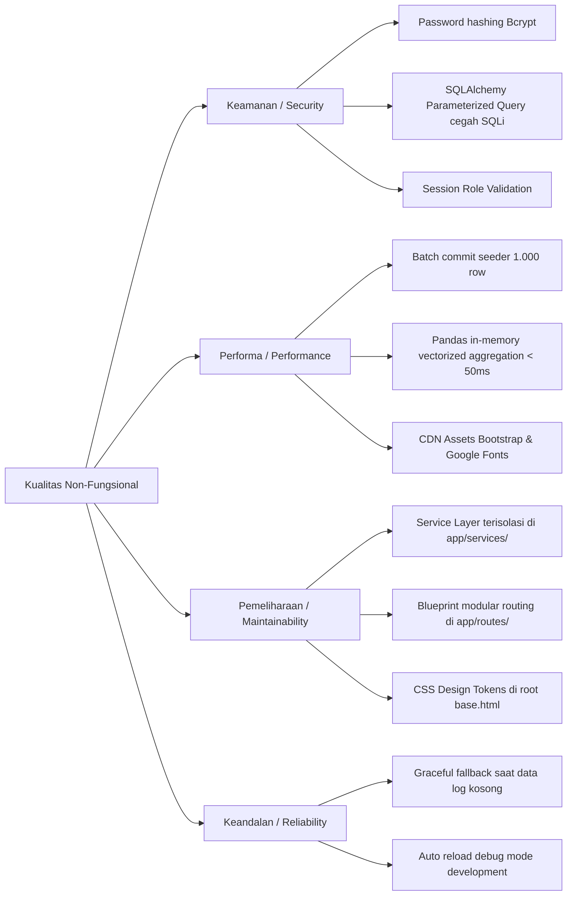
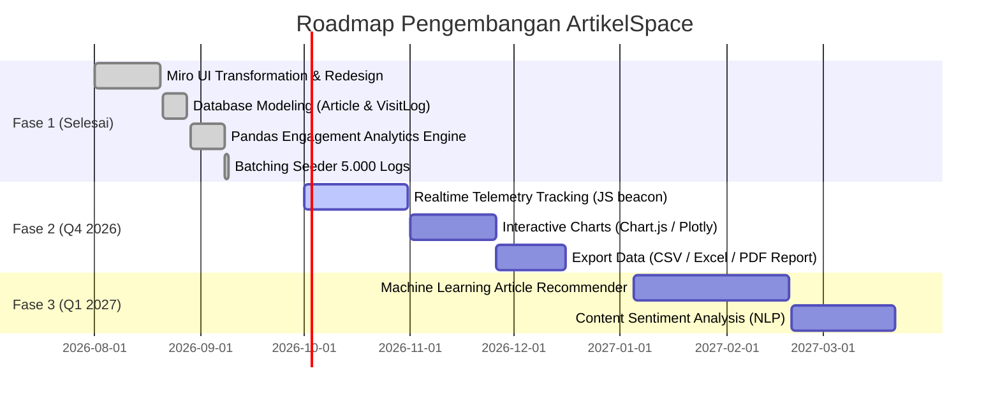

# 📄 Product Requirement Document (PRD)

## ArtikelSpace — AI-Powered Visual Knowledge Space & Engagement Analytics

---

| Dokumen Info       | Detail                                                                                                       |
| :----------------- | :----------------------------------------------------------------------------------------------------------- |
| **Nama Produk**    | **ArtikelSpace**                                                                                             |
| **Versi Produk**   | v1.2.0                                                                                                       |
| **Status Dokumen** | **Disetujui / Implementasi Selesai**                                                                         |
| **Target Rilis**   | Q3 2026                                                                                                      |
| **Tech Stack**     | Python 3.13, Flask, SQLAlchemy, Pandas, NumPy, Faker, PostgreSQL / SQLite, Bootstrap 5.3, Miro Design System |
| **Author / Lead**  | Data & Engineering Team                                                                                      |

---

## 1. 📌 Executive Summary & Product Vision

### 1.1 Visi Produk

**ArtikelSpace** adalah platform manajemen konten dan ruang kerja visual (_visual workspace_) yang menggabungkan kemudahan pembuatan artikel berbasis kanvas modular dengan mesin analitik data (_data engine_) berbasis **Pandas**. Platform ini dirancang untuk menjembatani kreator, pembaca, administrator, serta _data analyst_ dalam satu ekosistem terpadu yang estetis, cepat, dan berbasis wawasan data (_data-driven insights_).

### 1.2 Masalah yang Diselesaikan (_Problem Statements_)

1. **Kurangnya Visibilitas Metrik Pembaca:** Platform artikel konvensional hanya menghitung _page views_ mentah tanpa mengukur keterlibatan nyata (_active read time_, _scroll depth_, _interaction_, dan _bounce rate_).
2. **Ketiadaan Analisis Statistik Mendalam:** Kreator dan admin kesulitan mengetahui variabilitas ($\sigma^2$) popularitas artikel antar kategori dan tren regresi pertumbuhan kunjungan.
3. **Antarmuka Kaku & Monoton:** Pembaca jenuh dengan antarmuka berbasis daftar konvensional yang minim sentuhan visual interaktif.
4. **Pemisahan Logika Bisnis yang Buruk:** Aplikasi berbasis Flask sering kali mencampur aduk kalkulasi analitik ke dalam _controller/route_, menyulitkan pemeliharaan kode di masa depan.

### 1.3 Nilai Tambah (_Value Propositions_)

- **Miro Visual Design System:** Antarmuka modern menggunakan palet warna pastel _sticky notes_, tombol _pill_ hitam pekat, tipografi _Plus Jakarta Sans_, dan kartu fitur kanvas.
- **Dedicated Pandas Analytics Engine:** Pemrosesan data riil dari ribuan log kunjungan secara terisolasi di _service layer_ (`app/services/analytics.py`).
- **Analitik Keterlibatan Tingkat Lanjut:** Evaluasi _bounce rate_ berdasar kondisi multi-variabel, perhitungan varians durasi baca ($\sigma^2$), dan tren OLS Linear Regression 30 hari.
- **Seeder Otomatis & Teroptimasi:** Penghasil 50 artikel dan 5.000 log kunjungan realistis dengan teknik _batch commit_ (1.000 baris/transaksi) hemat memori.

---

## 2. 👥 User Persona & Target Audiens



---

## 3. 🏗️ Arsitektur Sistem & Struktur Folder

Aplikasi menerapkan **Clean Architecture & Separation of Concerns (SoC)** dengan memisahkan lapisan kontroler (_Routes_), lapisan logika komputasi data (_Services_), lapisan data (_Models_), dan lapisan antarmuka (_Templates_).

```
ARTIKEL_MANAGE/
├── config.py                     # Konfigurasi Environment (Development, Testing, Production)
├── run.py                        # Entry-point eksekusi server Flask
├── requirements.txt              # Daftar dependensi modul Python
├── README.md                     # Dokumentasi panduan teknis & alur aplikasi
├── PRD.md                        # Product Requirement Document
├── app/
│   ├── __init__.py               # Application Factory & Blueprint Initializer
│   ├── models.py                 # Definisi Schema Tabel SQLAlchemy ORM
│   ├── routes/                   # CONTROLLER LAYER
│   │   ├── __init__.py           # Inisialisasi blueprint 'module_name'
│   │   ├── main.py               # Rute halaman publik (Home, List, Add, Admin, Profile)
│   │   ├── article.py            # API RESTful untuk CRUD Artikel
│   │   ├── auth.py               # Autentikasi User (Login, Register, Logout)
│   │   ├── admin.py              # Controller Endpoint Admin Dashboard
│   │   ├── profile.py            # Controller Endpoint Profil Pengguna
│   │   └── analytics.py          # Controller Halaman & REST API Analitik Data
│   ├── services/                 # BUSINESS LOGIC & DATA LAYER
│   │   ├── __init__.py
│   │   ├── analytics.py          # Komputasi Pandas (Read Time, Bounce, Variance, OLS Trend)
│   │   └── seeder.py             # Generator data sintetis Faker (50 artikel, 5.000 log)
│   └── templates/                # PRESENTATION LAYER (Miro Design System)
│       ├── base.html             # Master Layout, Token Warna, Navbar, Footer, Toasts
│       ├── index.html            # Landing Page & Marketing Hero
│       ├── article_list.html     # Katalog Sticky-Notes & Pencarian Interaktif
│       ├── add_article.html      # Formulir Publikasi Artikel Split-View
│       ├── show_article.html     # Halaman Pembaca Detail Artikel
│       ├── login.html            # Form Masuk Pengguna
│       ├── register.html         # Form Pendaftaran Akun
│       ├── profile.html          # Ruang Portofolio & Kartu Profil Pengguna
│       ├── admin.html            # Workspace Kontrol Tabel Administrator
│       └── analytics.html        # Visual Dashboard Analitik Statistik
```

---

## 4. 🗄️ Spesifikasi Database & Data Modeling



---

## 5. ⚙️ Spesifikasi Fungsional Fitur (Functional Requirements)

### 5.1 Modul Autentikasi & Otorisasi

- **FR-AUTH-01 (Registrasi Pengguna):** Pengguna dapat mendaftarkan akun baru dengan `username`, `email`, `password`, dan pemilihan `role` (`user`/`admin`).
- **FR-AUTH-02 (Enkripsi Kata Sandi):** Kata sandi wajib di-_hash_ menggunakan algoritma satu arah yang aman (`Flask-Bcrypt`).
- **FR-AUTH-03 (Autentikasi Sesi):** Menggunakan `Flask Session` untuk menyimpan status login (`user_id`, `role`, `username`).
- **FR-AUTH-04 (Role-Based Access Control / RBAC):**
  - Hanya pengguna dengan `role = 'admin'` yang dapat mengakses data sensitif pada `/admin_dashboard` dan menghapus artikel di `/delete_article/<title>`.

### 5.2 Modul Manajemen Artikel (CRUD)

- **FR-ART-01 (Koleksi Artikel):** Mengambil dan menampilkan artikel dalam visual _sticky notes_ pastel dengan pagination/grid responsif.
- **FR-ART-02 (Pencarian & Filter):** Filter artikel secara _real-time_ berdasarkan judul (`title`) atau nama penulis (`author`).
- **FR-ART-03 (Publikasi Artikel):** Form pembuatan artikel dengan validasi kelengkapan data (judul, penulis, konten).
- **FR-ART-04 (Detail Pembaca / Reader Mode):** Tampilan membaca artikel yang nyaman dengan _breadcrumb_, inisial avatar, dan rekomendasi artikel terkait.
- **FR-ART-05 (Penghapusan Artikel):** Tombol aksi hapus hanya tampil dan dapat dieksekusi oleh Administrator dengan konfirmasi protektif.

### 5.3 Modul Engagement Analytics (Pandas Engine)

- **FR-ANL-01 (Kalkulasi Active Read Time):**
  Menghitung durasi baca aktif pengunjung secara agregat:
  $$\text{Rata-rata Waktu Baca (Menit)} = \frac{\sum \text{active\_time\_seconds}}{60 \times N}$$
- **FR-ANL-02 (Aturan Logika Bounce Rate):**
  Mengklasifikasikan kunjungan sebagai _bounce_ (**True**) HANYA JIKA memenuhi ketiga syarat secara bersamaan:
  $$\text{is\_bounce} = (\text{active\_time\_seconds} < 10) \land (\text{interaction\_count} == 0) \land (\text{max\_scroll\_depth} < 20)$$
  Persentase dihitung dengan: $\text{Bounce Rate (\%)} = \frac{\sum \text{is\_bounce}}{\text{Total Kunjungan}} \times 100$
- **FR-ANL-03 (Agregasi Kategori & Varians Waktu Aktif):**
  Menggunakan `df.groupby('category').agg(...)` untuk menghasilkan:
  - Jumlah artikel unik dan total kunjungan per kategori.
  - Rata-rata durasi aktif, scroll depth, dan persentase bounce.
  - Varians Waktu Aktif ($\sigma^2$) untuk mengukur disparitas _engagement_ audiens di tiap kategori:
    $$\sigma^2 = \frac{\sum (x_i - \mu)^2}{N - 1}$$
- **FR-ANL-04 (Tren Regresi Linier Popularitas 30 Hari):**
  Menggunakan Ordinary Least Squares (OLS) $y = mx + c$ via `numpy.polyfit` untuk menentukan arah tren kunjungan harian:
  - $m > +0.5 \implies$ **Tren Naik (Popularitas Meningkat)**
  - $m < -0.5 \implies$ **Tren Turun (Popularitas Menurun)**
  - $-0.5 \le m \le +0.5 \implies$ **Stabil / Fluktuasi Wajar**
- **FR-ANL-05 (Analisis Kanal Referrer):** Menghitung proporsi dan rasio retensi dari 4 sumber lalu lintas (_Organik Google_, _Media Sosial_, _Langsung_, _Tautan Internal_).
- **FR-ANL-06 (Top 5 Artikel):** Peringkat 5 artikel paling banyak dikunjungi beserta rata-rata kedalaman scroll.
- **FR-ANL-07 (RESTful API Endpoint):** Menyediakan JSON _feed_ pada `GET /api/analytics` untuk integrasi _dashboard BI_ eksternal.

### 5.4 Modul Data Seeder (Faker Generator)

- **FR-SED-01 (Pembuatan Data Sintetis):** Mampu menghasilkan 50 data artikel acak berbahasa Indonesia (`Faker('id_ID')`) dan 5.000 log interaksi kunjungan tersebar 30 hari terakhir.
- **FR-SED-02 (Efisiensi Memori / Batching):** Menerapkan mekanisme _batch commit_ setiap 1.000 baris data (`BATCH_SIZE = 1000`) untuk mencegah beban lonjakan RAM (_memory spike_).
- **FR-SED-03 (Re-seed On-Demand):** Tombol pemicu dari antarmuka (`POST /analytics/reseed`) untuk memperbarui data simulasi secara instan tanpa perlu akses terminal.

---

## 6. 🎨 Spesifikasi Desain Antarmuka (Miro Design System)

| Elemen Desain              | Token / Nilai                                                             | Penerapan                                                         |
| :------------------------- | :------------------------------------------------------------------------ | :---------------------------------------------------------------- |
| **Primary Color (CTA)**    | `#1c1c1e` (Miro Ink)                                                      | Tombol utama `.button-primary`, border-radius: `9999px` (Pill)    |
| **Brand Accent**           | `#ffd02f` (Canary Yellow)                                                 | Logo box, badge tag aktif, kartu sorotan `.card-feature-yellow`   |
| **Pastel Palette (Cards)** | Teal (`#c3faf5`), Rose (`#ffd8f4`), Coral (`#ffc6c6`), Orange (`#ffe6cd`) | Kartu sticky notes, visual kategori metrik                        |
| **Surfaces & Borders**     | Canvas (`#ffffff`), Surface (`#f7f8fa`), Hairline (`#e0e2e8`)             | Latar belakang modul, pembatas tabel, separator                   |
| **Typography**             | `Plus Jakarta Sans`, 400/500/600/700/800                                  | Tipografi modern dengan _negative letter-spacing_ pada _headline_ |
| **Feedback Elements**      | Pill Toast Notifications (Bottom-Right)                                   | Notifikasi respon AJAX sukses (`#00b473`) & error (`#e03131`)     |
| **Footer Component**       | Deep Dark Multi-Column Footer (`#1c1c1e`)                                 | Navigasi sekunder, info hak cipta, status token desain            |

---

## 7. 🔌 Spesifikasi API Endpoints

| Method | Endpoint                  | Fungsi                                                       | Hak Akses    | Format Respon |
| :----- | :------------------------ | :----------------------------------------------------------- | :----------- | :------------ |
| `GET`  | `/home`                   | Menampilkan Landing Page                                     | Publik       | HTML          |
| `GET`  | `/artikel_page`           | Menampilkan Daftar Artikel                                   | Publik       | HTML          |
| `GET`  | `/get_articles`           | Mengambil data artikel (dukung query `?title=` / `?author=`) | Publik       | JSON          |
| `POST` | `/add_articel`            | Menambahkan artikel baru                                     | User Login   | JSON          |
| `POST` | `/delete_article/<title>` | Menghapus artikel berdasarkan judul                          | Admin        | JSON          |
| `POST` | `/registrasi`             | Mendaftarkan akun baru                                       | Publik       | JSON          |
| `POST` | `/login`                  | Masuk ke akun                                                | Publik       | JSON          |
| `GET`  | `/logout`                 | Keluar dari sesi                                             | User Login   | Redirect      |
| `POST` | `/profil_user`            | Mengambil profil user & daftar artikel buatannya             | User Login   | JSON          |
| `POST` | `/admin_dashboard`        | Mengambil daftar seluruh user untuk admin                    | Admin        | JSON          |
| `GET`  | `/analytics`              | Menampilkan Dashboard Analitik Engagement                    | Publik       | HTML          |
| `GET`  | `/api/analytics`          | Mengambil data mentah kalkulasi Pandas                       | Publik       | JSON          |
| `POST` | `/analytics/reseed`       | Men-generate ulang 50 artikel & 5.000 log kunjungan          | Publik / Dev | JSON          |

---

## 8. 🛡️ Spesifikasi Non-Fungsional (Non-Functional Requirements)



---

## 9. 🚀 Panduan Instalasi & Eksekusi

### 9.1 Prasyarat Lingkungan

- Python 3.10+ (Direkomendasikan Python 3.13)
- PostgreSQL (Opsional, bawaan SQLite/pg8000 siap pakai)
- Git & Web Browser modern

### 9.2 Langkah Instalasi

```bash
# 1. Clone repository / Masuk ke folder proyek
cd "d:/Data Engineer/Python Blyat/FLASK/ARTIKEL_MANAGE"

# 2. Aktifkan Virtual Environment
.\env\Scripts\activate

# 3. Instalasi seluruh paket dependensi
pip install -r requirements.txt

# 4. Inisialisasi Skema Database
python -c "from app import create_app; app = create_app(); from app.models import db; db.create_all()"

# 5. Jalankan Seeder Data (50 Artikel + 5.000 Log Kunjungan)
python -m app.services.seeder

# 6. Jalankan Server Flask
python run.py
```

Akses aplikasi melalui peramban web pada URL: `http://127.0.0.1:5000`.

---

## 10. 🗺️ Roadmap Pengembangan Masa Depan



---

_Dokumen ini merupakan acuan spesifikasi resmi untuk operasional, pengujian, dan pengembangan fitur aplikasi **ArtikelSpace**._
