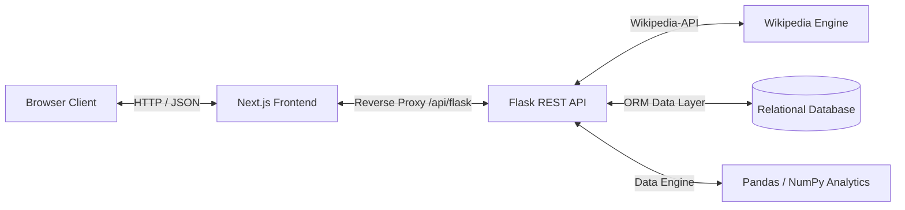

# ArtikelSpace – Modern Knowledge & Analytics Platform

Sistem manajemen artikel dan analitik interaksi berbasis arsitektur decoupled (Backend REST API + Modern Frontend). Menggabungkan penerbitan konten, integrasi sumber terbuka Wikipedia, pelacakan sesi baca real-time, dan pemrosesan statistik data keterlibatan pembaca.

---

## 🏗️ Arsitektur Sistem

Aplikasi terbagi menjadi dua subsistem independen:

1. **Backend Service (Python/Flask)**
   - REST API penyedia data JSON dan manajemen sesi login.
   - Lapisan ORM untuk persistensi data relasional.
   - Mesin analitik data terisolasi menggunakan agregasi Pandas & NumPy.
   - Integrasi eksternal Wikipedia API.

2. **Frontend Client (Next.js/React)**
   - Antarmuka berbasis Glassmorphism UI (Tailwind CSS).
   - Dynamic routing (App Router) dan state management di sisi klien.
   - Reverse proxy internal untuk komunikasi same-origin ke backend.



---

## ✨ Fitur-Fitur Utama

### 1. Manajemen Akun & Hak Akses

- **Registrasi & Otentikasi**: Pendaftaran akun baru, validasi kredensial, dan hashing sandi aman via Bcrypt.
- **Manajemen Sesi**: Sesi berbasis server-side cookie dengan proteksi state.
- **Kontrol Peran Pengguna (RBAC)**: Pemisahan hak akses antara pengguna biasa (`user`) dan pengelola sistem (`admin`).

### 2. Penerbitan & Pengelolaan Konten

- **Publikasi Artikel**: Penulisan artikel manual lengkap dengan atribusi penulis dan pemilihan kategori (Teknologi, Sains, Sejarah, Gaya Hidup, Berita Pendek, Umum).
- **Katalog & Pencarian Cepat**: Filter artikel dinamis berdasarkan kata kunci judul dan kategori topik.
- **Halaman Baca & Pengukur Sesi**: Tampilan reader yang nyaman dilengkapi tracking durasi aktif membaca dan perhitungan total pembaca permanen.
- **Profil Pengguna**: Manajemen portofolio artikel yang diterbitkan oleh masing-masing pengguna dengan opsi penghapusan mandiri.

### 3. Integrasi Eksternal Wikipedia

- **Pencarian Topik**: Mencari ensiklopedia publik Wikipedia langsung dari dashboard aplikasi (multi-bahasa: ID/EN).

> **⚠️ PENTING: PEMBARUAN VERIFIKASI EMAIL (2026-09-15)**
> Sistem kini mewajibkan verifikasi email nyata saat registrasi. Pengguna lama telah diatur otomatis menjadi `is_verified = True` melalui migrasi Alembic. Pastikan variabel lingkungan `MAIL_USERNAME` dan `MAIL_PASSWORD` (App Password) telah diatur di `.env` agar fitur pengiriman token OTP/Link berfungsi.

- **Pratinjau & Impor Cepat**: Review ringkasan artikel Wikipedia sebelum dimasukkan secara otomatis ke dalam arsip artikel lokal.

### 4. Mesin Analitik Keterlibatan (Pandas Engine)

- **Metrik Keterlibatan**: Kalkulasi waktu aktif membaca rata-rata, kedalaman scroll, dan interaksi per sesi.
- **Strict Bounce Rate**: Evaluasi kunjungan singkat berdasar ambang batas multi-variabel (waktu < 10 detik, tanpa klik, scroll < 20%).
- **Varians Waktu Baca ($\sigma^2$)**: Pengukuran stabilitas retensi pembaca per kategori konten.
- **Analisis Tren OLS Linear Regression**: Prediksi arah pertumbuhan trafik kunjungan selama 30 hari terakhir.
- **Distribusi Sumber Trafik**: Pemetaan lalu lintas berdasarkan kanal rujukan (Organik, Media Sosial, Langsung, Internal).

### 5. Dashboard Administrator

- **Pemantauan Pengguna**: Panel inspeksi seluruh akun terdaftar, distribusi peran, dan status aktivitas sistem.
- **Moderasi Konten**: Otoritas penghapusan artikel lintas penulis untuk menjaga integritas arsip.

---

## 📦 Skema Model Data (Konseptual)

Model relasional dirancang menggunakan pemisahan entitas inti:

- **Pengguna (`User`)**: Menyimpan identitas akun, kredensial terenkripsi, dan peran sistem.
- **Artikel (`Article`)**: Menyimpan metadata judul, slug, kategori, penulis, konten deskripsi, waktu rilis, serta relasi ke pengguna.
- **Sesi Membaca (`ReadingSession`)**: Mencatat jejak sesi pembaca nyata (waktu mulai, waktu selesai, dan penanda keaktifan).
- **Log Kunjungan (`VisitLog`)**: Mencatat riwayat metrik kuantitatif (durasi detik, kedalaman scroll, interaksi, status bounce, kanal rujukan) untuk kebutuhan komputasi analitik.

---

## 🚀 Panduan Menjalankan Aplikasi

### Kebutuhan Sistem

- Python 3.10+
- Node.js 18+ & npm
- Akses ke database relasional yang didukung SQLAlchemy

### 1. Menjalankan Backend (Flask)

```bash
# Buat dan aktifkan virtual environment
python -m venv env
# Windows:
env\Scripts\activate
# Linux/macOS:
# source env/bin/activate

# Pasang dependensi backend
pip install -r requirements.txt

# Siapkan migrasi dan skema data
flask db upgrade

# (Opsional) Jalankan data seeder untuk pengujian analitik
python -m app.services.seeder

# Jalankan server API backend (Port 5000)
python run.py
```

### 2. Menjalankan Frontend (Next.js)

Buka terminal baru:

```bash
cd frontend

# Pasang dependensi paket frontend
npm install

# Jalankan mode pengembangan (Port 3000)
npm run dev
```

Buka peramban di `http://localhost:3000`.

---

## 🔒 Konfigurasi Keamanan & Enkripsi

- Variabel lingkungan sensitif (kunci rahasia sesi, konfigurasi basis data) wajib dikelola melalui file lingkungan `.env` atau konfigurasi server produksi.
- Kredensial pengguna tidak pernah disimpan dalam bentuk teks biasa.
- Pembatasan endpoint mutasi data menggunakan dekorator autentikasi berlapis.

Seeder (`app/services/seeder.py`) uses `Faker('id_ID')` + `random`, commits per 1.000 rows, and enforces the bounce rule exactly.

---

## 📌 Future Improvements

- **Real tracking** (page‑view events, time‑on‑page) instead of simulated numbers.
- **Export** of analytics to CSV/Excel.
- **Role‑based access control** for the analytics page (admin‑only or premium users).
- **Unit tests** for the service layer (`pytest` + `flask-testing`).
- **Dockerisation** for easy deployment.

---

## 📜 License

This project is for educational purposes. Feel free to adapt the Miro design tokens and the analytics logic for your own projects.
